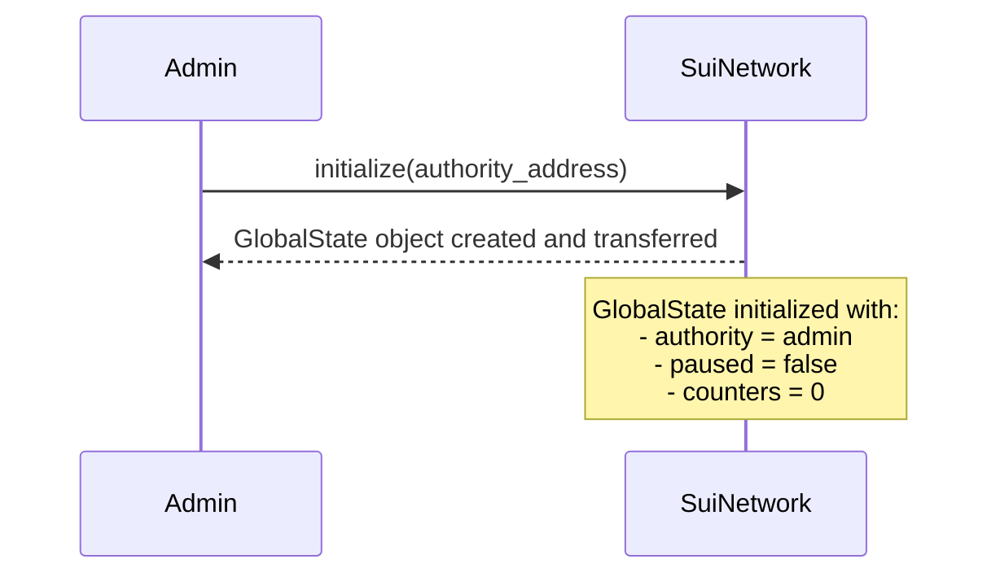
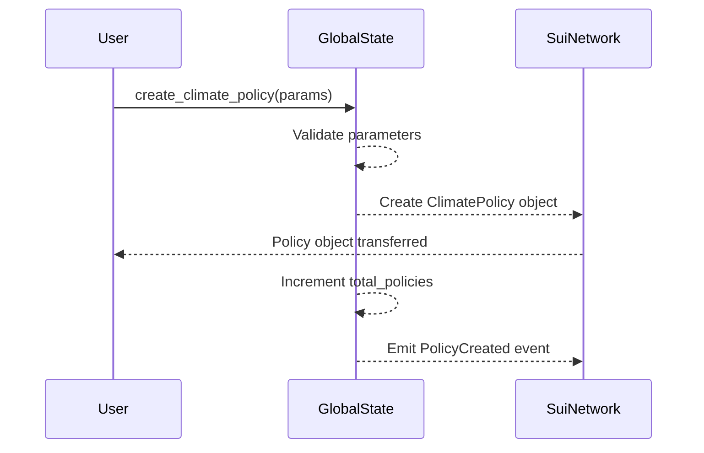
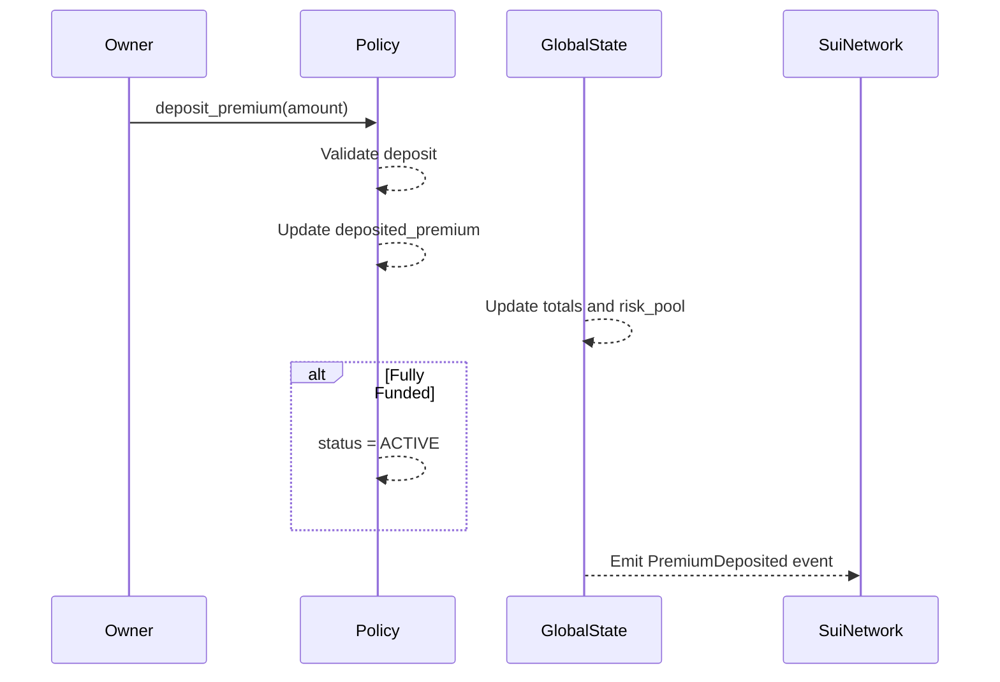
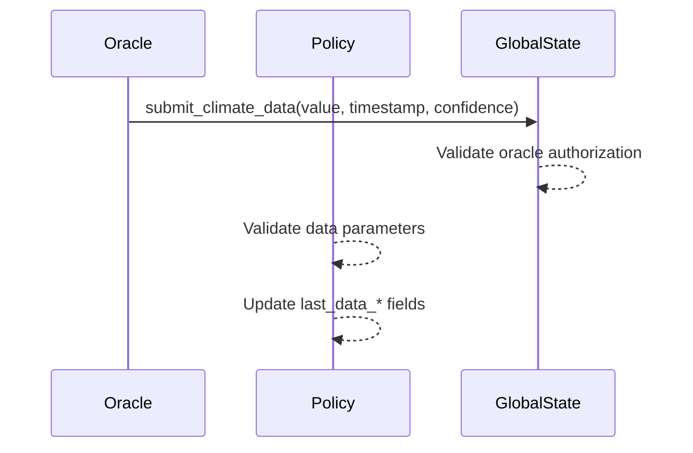
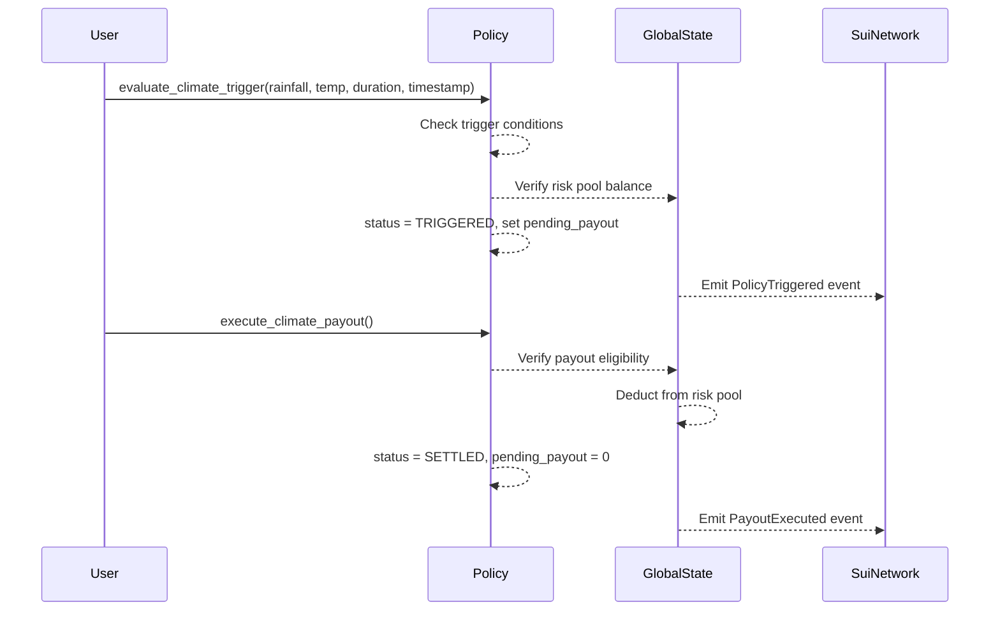
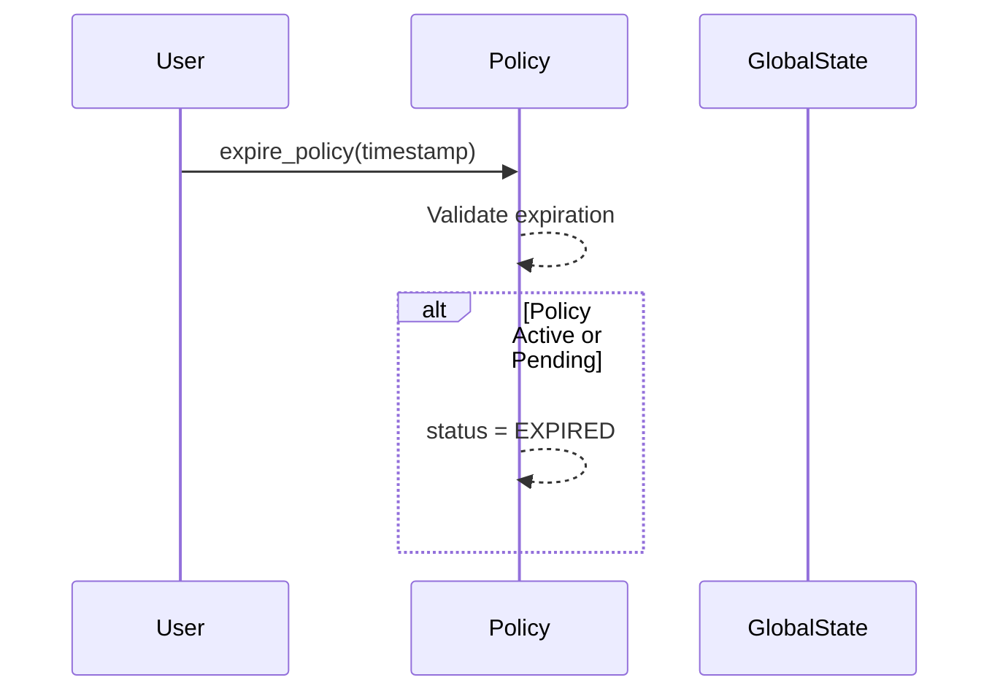
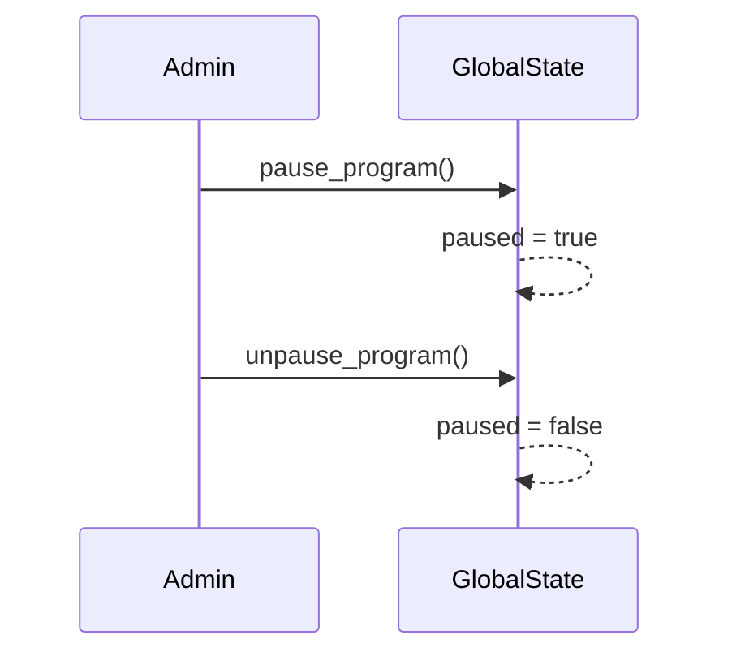
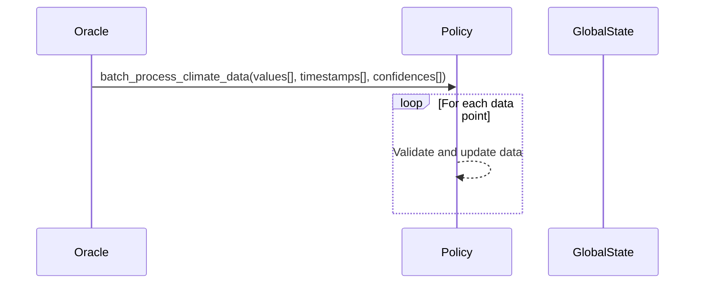
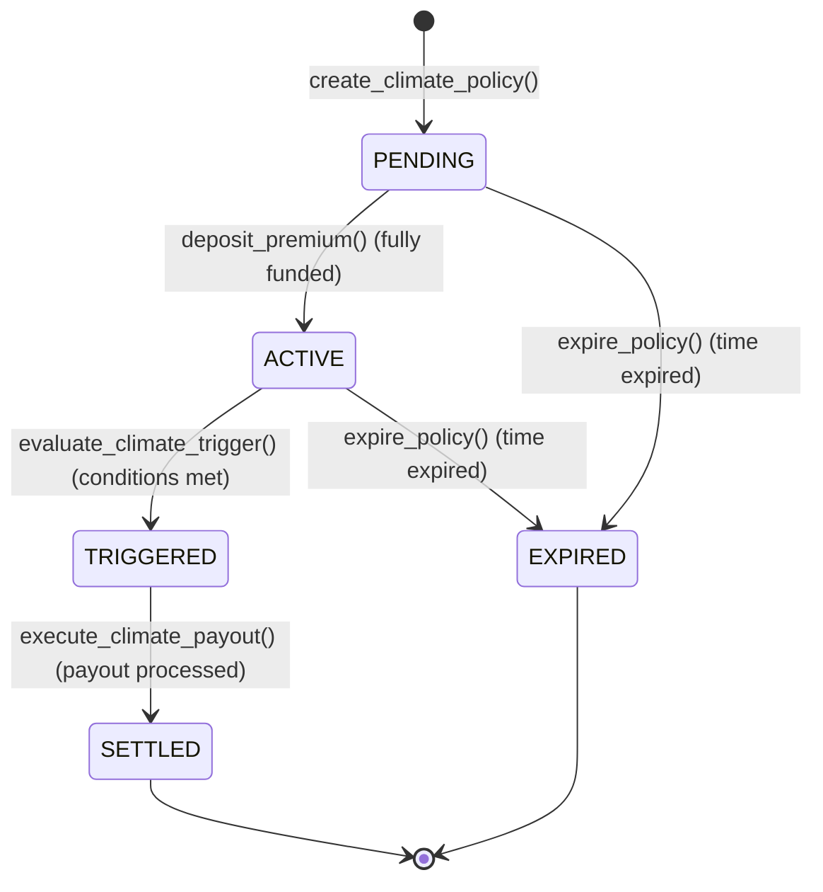

# AMOCA Climate Insurance Workflow Design Documentation

## Overview

This document outlines the detailed workflow designs for the AMOCA Climate Insurance protocol built on Sui blockchain. It covers the complete lifecycle of insurance policies, from creation to settlement, including administrative operations and oracle integrations.

## Core Workflows

### 1. Program Initialization Workflow

**Purpose**: Set up the global state and risk pool for the insurance program.

**Actors**: Program Authority (Admin)

**Sequence**:

**Steps**:

1. Admin calls `initialize()` with their address
2. System validates sender is the intended authority
3. Creates `GlobalState` object with initial values
4. Transfers ownership to authority address

**Validation**:

- Sender must be the designated authority
- Program must not already be initialized

### 2. Policy Creation Workflow

**Purpose**: Create a new parametric climate insurance policy.

**Actors**: Policy Owner (User)

**Sequence**:

**Parameters**:

- `owner`: Policy beneficiary address
- `coverage_amount`: Maximum payout (≥ MIN_COVERAGE_AMOUNT)
- `premium_amount`: Required premium (≥ MIN_PREMIUM_AMOUNT)
- `policy_duration`: Coverage period (MIN_DURATION ≤ duration ≤ MAX_DURATION)
- `trigger_rainfall`: Rainfall threshold (> 0 if used)
- `trigger_temperature`: Temperature threshold (> 0 if used)
- `measurement_period`: Data measurement window
- `minimum_duration`: Minimum trigger duration

**Validation**:

- Program not paused
- Sender is policy owner
- Owner address not zero
- Coverage and premium amounts meet minimums
- Duration within allowed range
- At least one trigger condition specified
- Measurement period > 0

**State Changes**:

- Policy status: PENDING
- Global total_policies incremented
- PolicyCreated event emitted

### 3. Premium Deposit Workflow

**Purpose**: Fund the insurance policy to activate coverage.

**Actors**: Policy Owner

**Sequence**:

**Validation**:

- Program not paused
- Sender is policy owner
- Amount > 0
- Policy status is PENDING or ACTIVE
- Amount ≤ remaining premium needed

**State Changes**:

- Policy deposited_premium increased by amount
- Global total_premiums_collected increased
- Global risk_pool_balance increased
- If fully funded: Policy status → ACTIVE
- PremiumDeposited event emitted

### 4. Oracle Data Submission Workflow

**Purpose**: Submit verified climate data for policy evaluation.

**Actors**: Authorized Oracle Provider

**Sequence**:

**Parameters**:

- `value`: Climate measurement value (> 0)
- `timestamp`: Data collection timestamp
- `confidence`: Data confidence level (MIN_CONFIDENCE ≤ confidence ≤ MAX_CONFIDENCE)

**Validation**:

- Program not paused
- Sender is authorized oracle (state.authority)
- Policy status is ACTIVE
- Value > 0
- Confidence within valid range
- Timestamp > last_data_timestamp
- Timestamp within policy coverage period

**State Changes**:

- Policy last_data_value, last_data_timestamp, last_data_confidence updated

### 5. Trigger Evaluation and Payout Workflow

**Purpose**: Evaluate trigger conditions and process automatic payouts.

**Actors**: Policy Owner or Authority

**Sequence**:

**Trigger Evaluation Validation**:

- Program not paused
- Sender is owner or authority
- Policy status is ACTIVE
- Timestamp within coverage period
- At least one trigger condition met:
  - Rainfall: current ≥ trigger_rainfall (if trigger_rainfall > 0)
  - Temperature: current ≥ trigger_temperature (if trigger_temperature > 0)
  - Duration: measurement_duration ≥ minimum_duration (if minimum_duration > 0)
- Risk pool has sufficient balance

**State Changes (Evaluation)**:

- Policy status → TRIGGERED
- Policy pending_payout = coverage_amount
- Policy last_data_* updated with trigger values
- PolicyTriggered event emitted

**Payout Execution Validation**:

- Program not paused
- Sender is owner or authority
- Policy status is TRIGGERED
- Pending payout > 0
- Risk pool balance ≥ payout amount

**State Changes (Payout)**:

- Global risk_pool_balance decreased by payout
- Global total_payouts_released increased by payout
- Policy pending_payout = 0
- Policy status → SETTLED
- PayoutExecuted event emitted

### 6. Policy Expiration Workflow

**Purpose**: Handle policy expiration without trigger events.

**Actors**: Policy Owner or Authority

**Sequence**:

**Validation**:

- Program not paused
- Sender is owner or authority
- Current timestamp ≥ policy end_timestamp

**State Changes**:

- If status was ACTIVE or PENDING → EXPIRED

### 7. Administrative Workflows

#### Program Pause/Unpause

**Purpose**: Emergency controls for program operations.

**Actors**: Program Authority

**Sequence**:

**Validation**:

- Sender is program authority

#### Batch Data Submission

**Purpose**: Efficiently submit multiple climate data points.

**Actors**: Authorized Oracle

**Sequence**:

**Validation**:

- All vectors have equal length
- Each data point passes individual validation
- Oracle authorization
- Policy active status

## Policy State Machine

## Error Handling and Validation

### Common Validation Patterns

1. **Authorization Checks**:
   - `assert_authority()`: Sender must be program authority
   - `assert_owner()`: Sender must be policy owner
   - `assert_owner_or_authority()`: Sender must be owner or authority

2. **Program State Checks**:
   - `assert_not_paused()`: Program must not be paused

3. **Business Logic Validation**:
   - Amount ranges (minimums, maximums)
   - Timestamp ordering and bounds
   - Status transitions
   - Balance sufficiency

### Error Recovery

- **Failed Transactions**: Sui transactions are atomic; failures revert all changes
- **Invalid Data**: Oracle submissions can be retried with corrected data
- **Insufficient Funds**: Users can deposit additional premiums
- **Expired Policies**: Cannot be reactivated; new policies must be created

## Batch Operations and Gas Optimization

### Batch Climate Data Submission

- Allows multiple data points in single transaction
- Reduces gas costs for frequent updates
- Maintains data integrity through validation loops

### Benefits

- **Cost Efficiency**: Lower per-data-point costs
- **Reliability**: Atomic updates prevent partial failures
- **Scalability**: Supports high-frequency data streams

## Monitoring and Analytics

### Key Metrics

- **Policy Metrics**: Total policies, active policies, triggered policies
- **Financial Metrics**: Premiums collected, payouts released, risk pool balance
- **Oracle Metrics**: Data submission frequency, confidence levels
- **Utilization Rate**: Payouts released / Premiums collected

### Health Checks

- **Risk Pool Health**: Balance > 25% of total premiums
- **Policy Expiration Monitoring**: Automatic expiration processing
- **Oracle Data Freshness**: Timestamp validation
- **Program Status**: Pause state monitoring

## Security Considerations

### Access Control

- **Role-Based Access**: Authority, owners, oracles have distinct permissions
- **Object Ownership**: Policies owned by creators, state owned by authority
- **Transaction Validation**: All inputs validated before state changes

### Economic Security

- **Risk Pool Management**: Sufficient reserves for payouts
- **Premium Validation**: Prevents underfunding of policies
- **Payout Limits**: Coverage amounts checked against pool balance

### Oracle Security

- **Authorization**: Only approved oracles can submit data
- **Data Validation**: Confidence levels and timestamp checks
- **Consensus**: Future multi-oracle consensus mechanisms

## Future Workflow Enhancements

### Planned Features

1. **Multi-Oracle Consensus**:
   - Multiple oracles required for trigger confirmation
   - Reputation-weighted consensus
   - Dispute resolution mechanisms

2. **Automated Keepers**:
   - Scheduled policy expiration checks
   - Automated trigger evaluation
   - Gas-optimized batch processing

3. **Policy Transfers**:
   - Secondary market for active policies
   - Transfer validation workflows
   - Ownership change handling

4. **Advanced Triggers**:
   - Multi-parameter composite triggers
   - Time-weighted calculations
   - Geographic boundary validation

This workflow design provides a robust foundation for the AMOCA Climate Insurance protocol, ensuring secure, efficient, and transparent climate risk management on the Sui blockchain.
